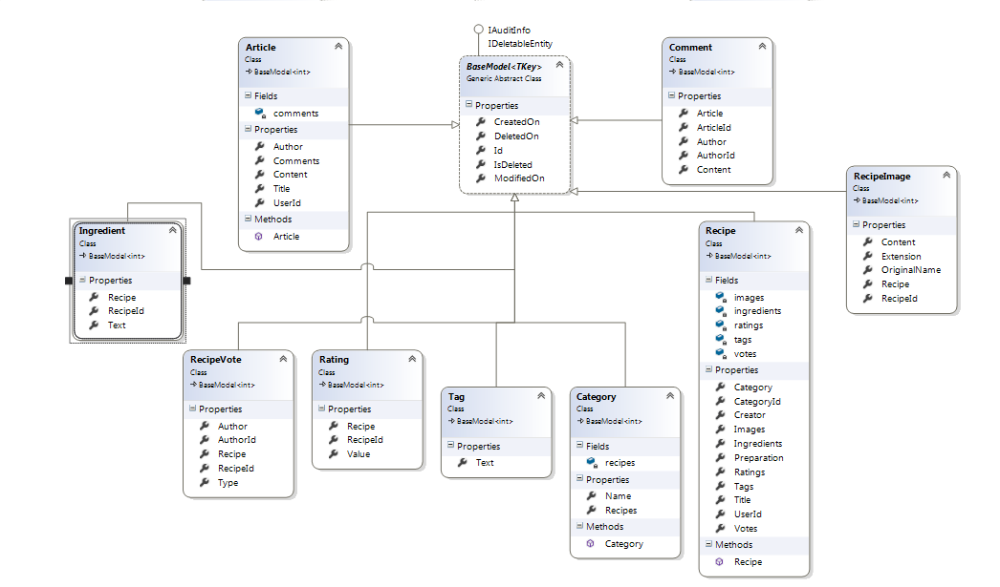

# Heroically Recipes

----------
### Source control repository URI:

[Heroically-Recipes](https://github.com/MystFan/Heroically-Recipes) 

### Database Models Class Diagram

### Public MVC Controllers

## BaseController

Abstract class who inherited all controllers with ICacheService property.

## AccountController and ManageController

These controllers take care of users accounts.

## HomeController

----------
**Actions:**

 * **Index()** return default view - **GET**
 * **GetNewestArticles()** return partial view **ArticlesListPartial.cshtml** with newest artcles - **GET**
 * **GetImage(string id)** return **FileContentResult** with recipe image - **POST**
 * **GetTopRecipes()** return partial view **SliderPartial** with top 5 recipes from **Cache** - **GET**

# MVC Areas

## Users area

## UsersBaseController

Abstarct class with  [Authorize] attribute

## RecipesController

----------
**Actions:**

 * **All(int page = 1)** return default view with paged recipes **from Cache** per page - **GET**
 * **SearchByTitle(string titleQuery)** return partial view **RecipesListPartial** with all founded recipes **from Cache** by param - **GET** **[AjaxOnly] [ValidateAntiForgeryToken] [OutputCache(Duration = 5 * 60, VaryByParam = "titleQuery")]**
 * **Create()** return default view **Create** recipe - **GET**
 * **Create(RecipeCreateViewModel model)** create recipe and redirect - **POST** [ValidateAntiForgeryToken]
 * **Details(string id)** return default view with recipe details page **from Cache** - **GET**
 * **GetByTagName(string tagName = GlobalConstants.DefaultTagName)** return default view with founded recipes **from Cache** by tag name - **GET**
 * **GetByNickname(string nickname)** return partial **UserRecipesListPartial** view with founded recipes from **from Cache** by nickname - **GET**
 * **GetRecipePreparation(string id)** return content with recipe preparation - **GET** **AJAX** [AjaxOnly]

## ArticlesController

----------
**Actions:**

 * **Index(int page = 1)** return default view with paged articles  **from Cache** per page - **GET**
 * **Details(int id)** return default view with article details page  **from Cache** by id - **GET**

## CategoriesController

----------
**Actions:**

 * **All()** return partial view **CategoriesPartial** with all categories  **from Cache** - **GET**
 * **Private action GetCategories()**

## ProfileController

----------
**Actions:**

 * **Index()** return profile page with UserViewModel all info - **GET**

## TagsController

----------
**Actions:**

 * **GetTags()** return partial view **TagsPartial** with all tags - **GET** [ChildActionOnly]
 * **All()** return partial view **TagsListPartial** with all tags from **Cache** - **GET**  [ChildActionOnly] [AllowAnonymous]

## VotesController

----------
**Actions:**

 * **Vote(int recipeId, int vote)** return **JsonResult** **new { Count = recipeVotes }** with total votes -  **AJAX** **GET** [AjaxOnly]

# Administration area

## AdminBaseController  : BaseController

Abstarct class with  [Authorize(Roles = "Admin")] attribute

## ArticlesAdminController

Admin Read Edit Delete operations using **Telerik Kendo MVC Grid 30 days Trial**

----------
**Actions:**

 * **AjaxIndex([DataSourceRequest]DataSourceRequest request)** - Read
 * **Edit([DataSourceRequest] DataSourceRequest request, ArticleAdminEditInputModel model)** - Update
 * **Delete([DataSourceRequest] DataSourceRequest request, ArticleAdminEditInputModel model)** - Delete

## RecipesAdminController

Admin Read Edit Delete operations using **Telerik Kendo MVC Grid 30 days Trial**

----------
**Actions:**

 * **AjaxIndex([DataSourceRequest]DataSourceRequest request)** - Read
 * **Edit([DataSourceRequest] DataSourceRequest request, RecipeAdminInputModel model)** - Update
 * **Delete([DataSourceRequest] DataSourceRequest request, RecipeAdminInputModel model)** - Delete

## CommentsAdminController

Admin Read Edit Delete operations using **Telerik Kendo MVC Grid 30 days Trial**

----------
**Actions:**

 * **AjaxIndex([DataSourceRequest]DataSourceRequest request)** - Read
 * **Edit([DataSourceRequest] DataSourceRequest request, CommentAdminEditInputModel model)** - Update
 * **Delete([DataSourceRequest] DataSourceRequest request, CommentAdminEditInputModel model)** - Delete

# SignalR

## CommentSignalRController

**GetComment(int articleId, string userId, string comment)** adding article comment

# Unit Tests

 * [Controllers tests](https://github.com/MystFan/Heroically-Recipes/tree/master/Source/HeroicallyRecipes/Tests/HeroicallyRecipes.Tests/ControllersTests) 
 * [Routes tests](https://github.com/MystFan/Heroically-Recipes/tree/master/Source/HeroicallyRecipes/Tests/HeroicallyRecipes.Tests/RouteTests) 
 

